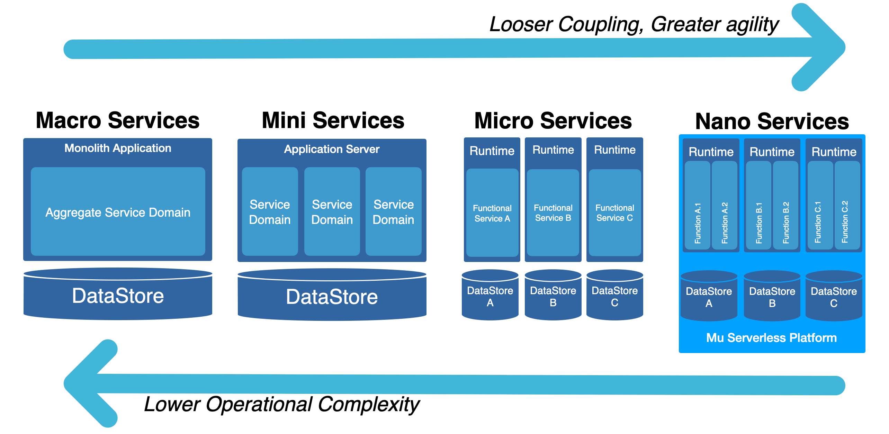

# What is Serverless?

Serverless Computing is a virtualization-related paradigm that focuses on increasing productivity by simplifying application management and enabling developers to focus on business capabilities, rather than the surrounding internals.

Serverless comes from the enablement of two layers that support the full DevOps model

- **Backend-as-a-Service (BaaS)** - which focuses on operations processes to enable automations that simplify provisioning, patching, scaling, security and high availability.
- **Functions-as-a-Service (FaaS)** - where applications are broken up into small pieces of code (nano services) which are dynamically scheduled and run on-demand. The benefits of this approach relies on code execution *only when needed*, indirectly solving one of the last challenges in the field: elastic capacity.

This differs from a classic approach where applications are loaded into a server spending most of their time idle, waiting for requests.

## What is CARE ?

CARE stands for **Concurrency**, **Availability**,  **Resiliency** & **Elasticity**, the acronym represents the key capabilities of a proper middleware architecture as detailled below:

### Resiliency and Availability

Resiliency and availability refers to the ability of a  system to continue operating, despite the failure or sub-optimal  performance of some of its components.

In the case of the Mu platform:

- The control plane is a set of components that manages function definitions.
- The data plane is a set of components that executes functions in response to invocation requests.

For resiliency and high availability, both the control  plane and data plane components are distributed across different nodes in the cluster. You may decide to improve availability by deploying the platform into different regions or availability zone. If one of the  domains ceases to be available, the components in the remaining domains take over to ensure that function definition management and execution  are not disrupted.

### Concurrency and Elasticity

Concurrency refers to the ability of a system to run  multiple operations in parallel using shared resources.
Elasticity refers to the ability of the system to scale capacity (both up and down) to meet demand.

In the case of functions, when a function is invoked for the first time, the function's image is run as a container.
When the function is executing inside the container, the function can read from and write to other shared  resources and services running in the same subnet (for example, Database as a Service). The function can also read from and write to other  shared resources (for example, Object Storage), and other Oracle Cloud Services.  

If a function receives multiple calls while it is currently executing, the platform automatically and seamlessly scales horizontally to serve all the incoming requests. As such, containers are scaled up/down to meet demand up to the limit specified in the configuration.

## Why using Functions?

In mathematics, a **function** is a relation between a set of inputs, and a set of permissible outputs where the property that each input is related to exactly one output. functions are **simple**, **composable** and **reusable**.

Functions are:

* **An Agility Enabler** - Functions improve service loose coupling, the lower the coupling, the faster to iterate.
* **Easy to use** - Mu is easy to use & easy to program. It enables the developers to focus on the business logic away from the typical operational complexities associated with this type of architecture.
* **Pre-wired** - No need to worries about observability, tracing and logging. Mu functions are pre-wired with default operational dashboards.
* **Flexible** - Functions can be implemented in "any" languages, with out of the box support for Java, JavaScript (Node), Go, Python and Ruby.

### Serverless Functions vs Microservices?

Microservice defines an architecture which decompose large functional domains (otherwise called monolith) into small independent services (APIs). By reducing  the functional surface of the API, we implicitly recude the data it manages - making the service easier to replace and scale.

However, the real complexity with micro-services doesn't lie in the functional split. Without proper precautions, the architecture becomes tedious to monitor, maintain and operate. RACE capabilities are particularly complex to implement and require dedicated experts.

With the introduction of Serverless functions, all the plumbing needed to provision, monitor, scale, patch and maintain the environment is provided by the platform itself: developers can focus on what matters most - business logic.

### Functions vs Containers

A function is a container with a <u>set of specific traits</u>:

- **Short running** - functions are particularly well suited for OLTP processing where the system responds immediately to requests. If you are interested is long running processes, please see the section down below.
- **Ephemeral** - functions live for a predefined amount of time. if a function goes past the limit, it is killed.
- **Stateless** - functions do not carry any state and therefore promote a [share nothing architecture](https://en.wikipedia.org/wiki/Shared-nothing_architecture).
- **Invoked** - functions only use compute resources once triggered.
- **Bounded** - functions carry tight resource limits in terms of memory and cpu.
- **Single Purpose** - functions are piece of logic that do one thing well. They indirectly helps in terms of reusability and composition.
- **Self-contained** - functions are autonomous and do/should not need 3rd party dependencies.
- **Simple** - last but not least, simplicity. In the distributed landscape it is common to compose different tech to achieve a given goal. Those tech require expert's skills which can be difficult to master. Functions (and their serverless platform) come with the tooling that abstracts this complexity bu providing an out of the box, ready to use platform.

