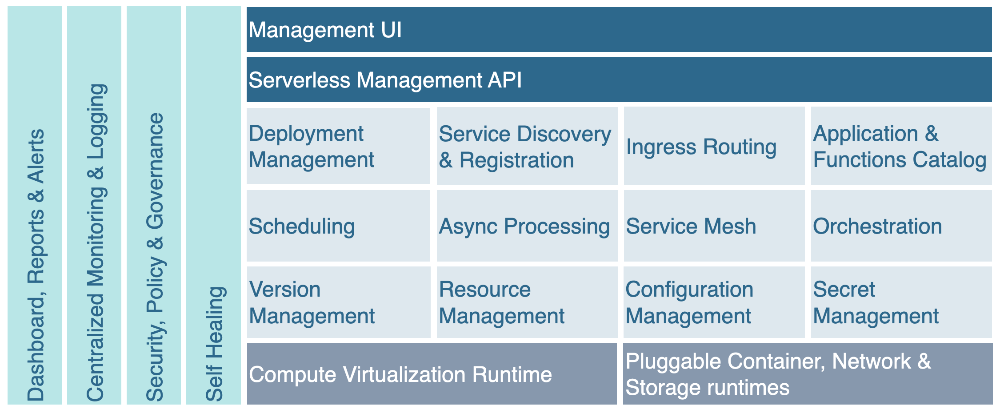

# What is Mu?
**Mu** is a **serverless** platform **tailored** with some of the **best applications** in their respective **categories**. The selection puts an effort in picking software that is particularly **lean** in terms of **resource utilization** without **sacrificing features**.

Mu is **easy to use**: it comes **preconfigured** and **ready to deploy** with tooling that **simplifies** the day-to-day.

Last but not least, Mu is **free** and **open-source**. It has a strong enterprise focus with emphasis on the following capabilities:

## What does Mu stand for?

The symbol μ comes from the Greek μικρός (mikrós) and is commonly pronounced as "micro" or "mu". It is used to reference a factor of one millionth or more generally metrics at a microscopic scale.

## Why do you need Mu?

There are multiple reasons you would consider your own on premise/cloud deployment rather than a commercial alternative. For instance:

- **Architecture freedom** - the main issue with any commercial offering is vendor lock in. With Mu, you are free to deploy the platform on-premise, on any cloud or even as part of your own stack. Freedom.
- **Tight regulations** - should they be internal or external, regulations may force you to run your own instance. Here I am particularly thinking about government regulations such as the [CloudAct](https://en.wikipedia.org/wiki/CLOUD_Act) or the [NIL](https://en.wikipedia.org/wiki/National_Intelligence_Law_of_the_People%27s_Republic_of_China) and its impact on foreign operations/businesses.
- **Region's Unavailability** - You may operate in a region of the world where there is no commercial availability, and your can't accept high service latencies. For the same reasons, support may not be available in your time zone forcing to run your own operational team.
- **OpenSource alignment** - Mu is opensource and tries to align with products in the same category. There are no intent to sell a commercial licensing.
- **Caps limits** - commercial offerings are typically bounded to default limits. While those can be extended, it's a process and comes at a cost. You are in full control with Mu.
- **Cost** - Commercial offering must be taken holistically, add the API Management, CIAM and storage, and you may realise that running your own ecosystem may be more cost-effective - your mileage may vary.
- **Extensions** - Last but not least, the core of an opensource product can be extended by the community. commercial alternatives are not flexible in that matter.

## Why did we create Mu?

* Lack of proper FAAS offering in the open source space
* It appears Oracle is not investing on `Project Fn` anymore, or at least not making the changes public.
* 
* Any of the points from the previous question

## What products compose Mu?

Mu is a serverless platform tailored with some of the best applications in their respective categories. The selection puts an effort in picking software that is particularly lean in terms of resource utilization without sacrificing features.

Mu would not be without the following opensource projects:

- **Oracle's Project Fn** - A excellent function serverless project based on docker. 
- **Grafana Suite** - A de-facto standard in the observability space (Grafana, Prometheus, Loki, Tempo)
- **TimberIO's Vector** - A centralized logging aggregator -  Another Gem which shines by its low resource utilisation, performance and features.
- **Nats.io** - A gem for streaming and subscription management.
- **Rancher K3S** - A full featured, lean distribution of Kubernetes.

### Tooling

- Terraform
- Helmsman

## What is Mu Architecture?

## How does it work?

## What Happens When You Deploy a Function?

When you have written the code for a function and it's ready to deploy,  you can use CLI commands to perform
all the deployment operations in sequence: 

- building a Docker image from the function
- providing a definition of the function in a func.yaml file that includes:
  - the maximum length of time the function is allowed to execute for 
  - the maximum amount of memory the function is allowed to consume 
- pushing the image to the specified Docker registry
- uploading function metadata (including the memory and time restrictions, and a link to the image in the Docker registry)

## What Happens When You Invoke a Function?

You can invoke a function from:

- The CLI.
- An HTTP request invocation endpoint.
- Based on time patterns
- From an event

When a function is invoked for the first time, the platform:

- identifies the Docker image of the function to pull from the Docker registry
- execute the function by running the function's image as a container on an instance in a subnet associated with the
  application to which the function belongs

When the function is executing inside the container, the function can read from and write to other resources and
services running in the same subnet (for example, Database as a Service). The function can also read from and write
to other shared resources (for example, Object Storage), and other Oracle Cloud Services. You can specify the maximum
length of  time the function is allowed to execute by setting a timeout in the  func.yaml file or in the Console.

Functions and platform logs are sent to Loki (an internal component) or forwarded to a syslog destination.

When the function has finished executing and after a period being idle, the Docker container is removed.
If another call is triggered to the same function before the container is removed, the second request is routed to
the same running container to optimize load time.

When multiple calls are triggered to the same function, the platform scales horizontally to serve incoming requests in
parallel and starts additional containers to handle the load. 

At any time, the platform keeps track of invocations and metrics for observability.

### How to run OLAP or long-running processes

Mu provides 3 patterns to implement long running processes

- **Async processing** - while not a direct solution - asynchronous processing can help mitigate the pressure on low latency. Typically used within a CQRS architecture, it allows to perform an action at a later time. The feature shines when coupled with serverless batch compute processings.
- **Step functions** - allow running orchestrations (steps) reliably.
- **Serverless batch compute** - is an upcoming feature that is not yet available.

## Mu vs Project Fn?

## Mu vs other OpenSource projects?

## Who created Mu?

Hi, my name is Olivier Refalo - I don't watch TV, rather I write software to learn the tech and frame better architectures. Mu is one of the 3 disruptors I must release before retirement.

