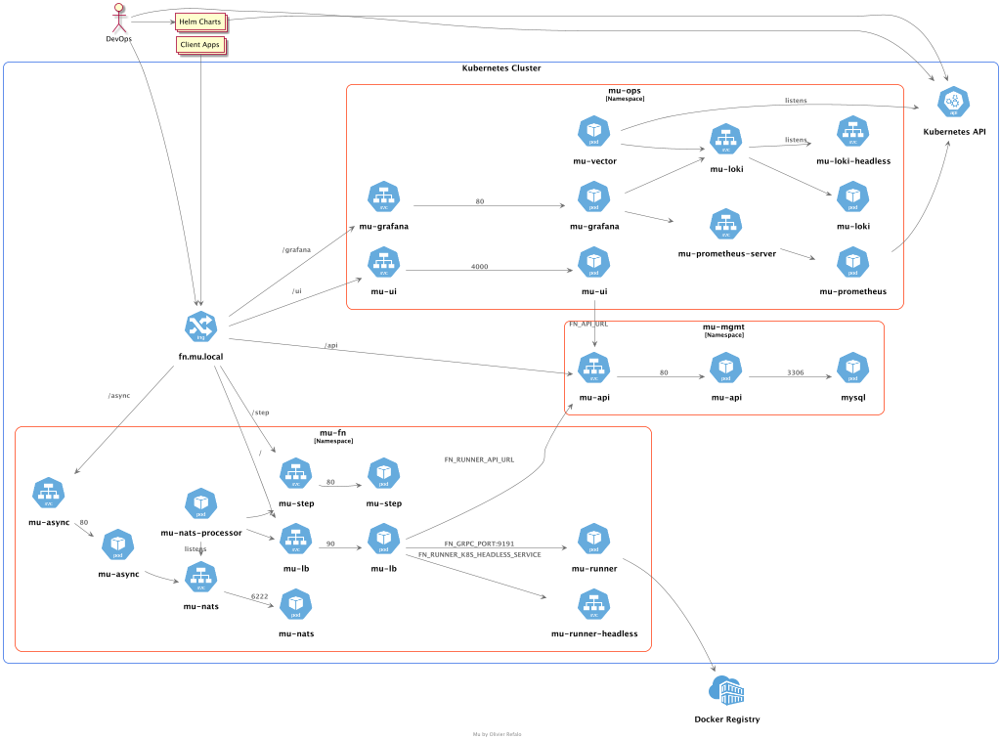

# What is Mu?
**Mu** is a **serverless** platform **tailored** with some of the **best applications** in their respective **categories**. The selection puts an effort in picking software that is particularly **lean** in terms of **resource utilization** without **sacrificing features**.

Mu is **easy to use**: it comes **preconfigured** and **ready to deploy** with tooling that **simplifies** the day-to-day.

Last but not least, Mu is **free** and **open-source**. It has a strong enterprise focus with emphasis on the following capabilities:

## What does Mu stand for?

The symbol μ comes from the Greek μικρός (mikrós) and is commonly pronounced as "micro" or "mu". It is used to reference a factor of one millionth or more generally metrics at a microscopic scale.

## Why do you need Mu?

There are multiple reasons you would consider your own on premise/cloud deployment rather than a commercial FAAS alternative. For instance:

- **Architecture freedom** - The first concern with any commercial offering is vendor lock in. With Mu, you are free to deploy the platform on-premise, on any cloud or even as part of your own stack.
- **Tight regulations** - Should they be internal or external, regulations may force you to run your own instance. Here I am particularly thinking about government regulations such as the [CloudAct](https://en.wikipedia.org/wiki/CLOUD_Act) or the [NIL](https://en.wikipedia.org/wiki/National_Intelligence_Law_of_the_People%27s_Republic_of_China) and their impacts on foreign business operations.
- **Capex vs Opex** - From a financial standpoint, your company prefers to make a capital investment rather than renting a service.
- **Open source alignment** - Mu is open source and tries to align with products in the same category. There are no intent to sell a commercial licensing.
- **Dedicated resources** - Commercial functions offerings typically leverage a shared concurrency model which leads to throttled execution, slow interactions and frustrated users. With Mu you have full control about how the resources are shared.
- **Caps limits** - Commercial offerings are typically bounded to default limits. It's not just memory or cpu; parameters like max concurrency limits have significative impacts on error rates. While those can be extended, it's a process and comes at a cost. 
- **Cost** - Commercial offering must be taken holistically, add an API Manager, a CIAM, storage & bandwidth - Your milage may vary, but you may realise that running your own ecosystem to be more cost-effective.
- **Extensability** - Last but not least, the core of an open source product can be extended by the community. commercial alternatives are not flexible in that matter.

## Why did we create Mu?

* Lack of proper FAAS offering in the open source space.
* It appears Oracle is not investing on `Project Fn` anymore, or at least not making the changes public.
* Any of the points from the previous question.

## What products compose Mu?

Mu is a serverless platform tailored with some of the best applications in their respective categories. The selection puts an effort in picking software that are lean in terms of resource utilization without sacrificing features.

Mu would not be without the following opensource projects:

- **Oracle's Project Fn** - A excellent function serverless project based on Docker. 
- **Grafana Suite** - A de-facto standard in the observability space (Grafana, Prometheus, Loki, Tempo)
- **Nats.io** - A gem: full featured subscription management platform which runs on <1MB of ram
- **TimberIO's Vector** - A centralized logging aggregator -  Another gem which shines by its low resource utilisation, performance and features.
- **Rancher K3S** - A full featured, lean distribution of Kubernetes.

### Tooling

The following tooling is used to provision the Mu platform.

- Terraform - an IaC product well tailored for infrastructure.
- Helmsman - a superset of helm with bring software/component provisioning to the next level

## What is the Mu Architecture?

Mu is built on top of kubernetes - an opensource cloud management platform.

## What Happens When You Deploy a Function?

When you have code for a function and it's ready to deploy,  you can use CLI commands to performal all the deployment operations, in sequence: 

- building a Docker image from the function code using a based image template
- providing a definition of the function in a func.yaml file that includes:
  - the maximum length of time the function is allowed to execute for 
  - the maximum amount of memory the function is allowed to consume 
- pushing the image to the specified Docker registry
- uploading function metadata (including the memory and time restrictions, and a link to the image in the Docker registry)

## What Happens When You Invoke a Function?

You can invoke a function from:

- The CLI.
- An HTTP request invocation endpoint.
- Based on a time pattern
- From an event

When a function is invoked for the first time, the platform:

- Identifies the Docker image of the function to pull from the Docker registry
- Execute the function by running the function's image as a container

You can specify the maximum length of  time the function is allowed to execute by setting a timeout in the  func.yaml file or in the Console. Functions and platform logs are sent to Loki (an internal component) or forwarded to a syslog destination. When the function has finished executing and after a idle period, the Docker container is removed.

If another call is triggered to the same function before the container is removed, the second request is routed to the same running container to optimize load time.

When multiple calls are triggered to the same function, the platform scales horizontally to serve incoming requests in parallel and starts additional containers to handle the load. 

At any time, the platform keeps track of invocations and metrics for observability.

## How to run OLAP or long-running processes

Mu provides 3 patterns to implement long running processes

- **Async processing** - while not a direct solution - asynchronous processing can help mitigate the pressure on low latency. Typically used within a CQRS architecture, it allows to perform an action at a later time. The feature shines when coupled with serverless batch compute processings.
- **Step functions** - allow running orchestrations (steps) reliably.
- **Serverless batch compute** - is an upcoming feature that is not yet available.

## Mu vs Project Fn?

Mu would not be without Project Fn. In alignment with the other components of the suite - Mu is a distribution of Project Fn which provides a complete  solution to run a production serverless functions cluster.

Mu provides:

* A formal distribution using Helm
* The ability to discover runner nodes dynamically
* Async processing (Coming soon)
* Batch compute (Coming soon)
* Centralized Logging
* Centralized Observability
* Centralized Distributed Tracing (Coming soon) 
* Preconfigured dashboards & alerts

## Mu vs other open source projects?

I was suprise to see that most open source serverless alternativites either, do not provide functions out of the box, or are built around a CAAS (Container As A Service) architecture. Project Fn has a very unique wait of enableling docker which makes it a real FAAS platform. 

## Who created Mu?

Hi, my name is Olivier Refalo - I don't watch TV, rather I write software to learn the tech and frame better architectures. Mu is one of the 3 disruptors I must release before retirement.

